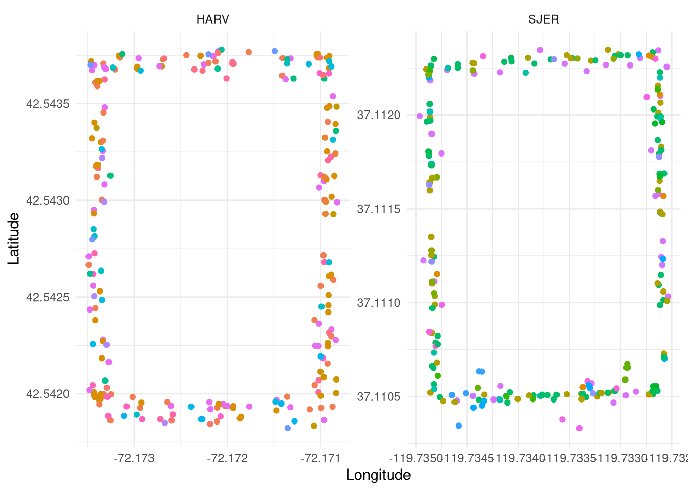
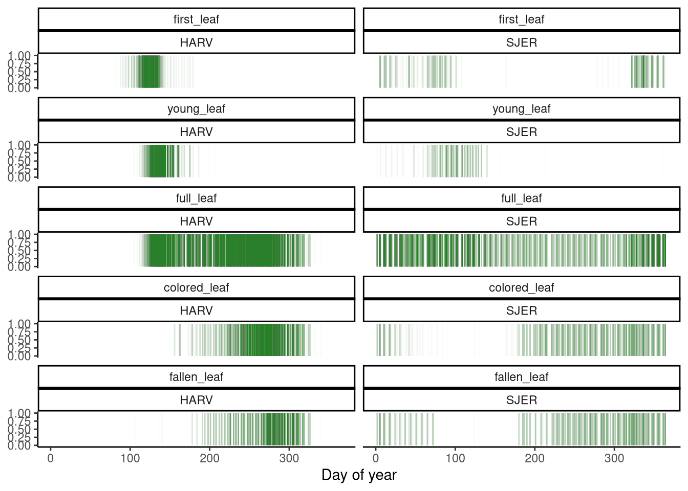
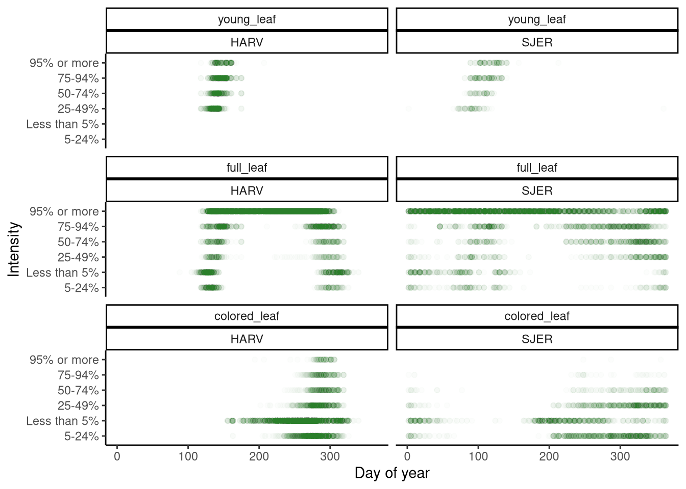
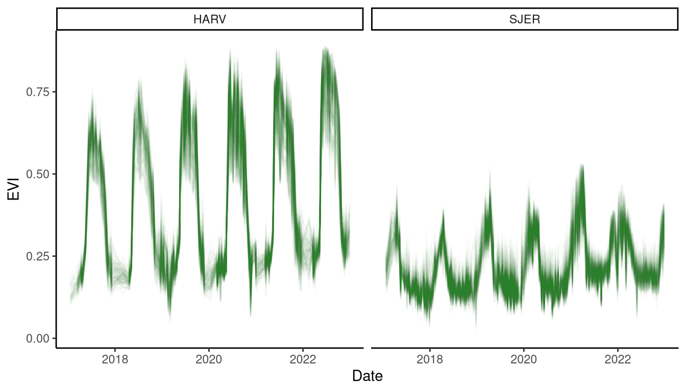
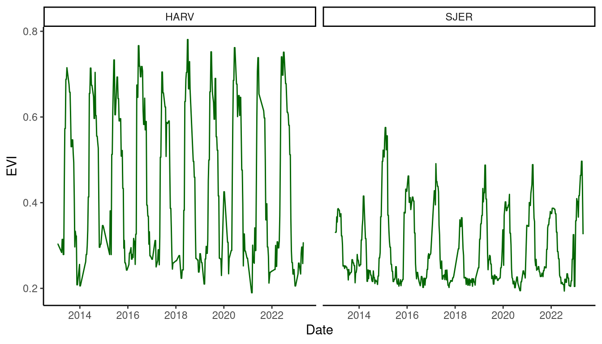
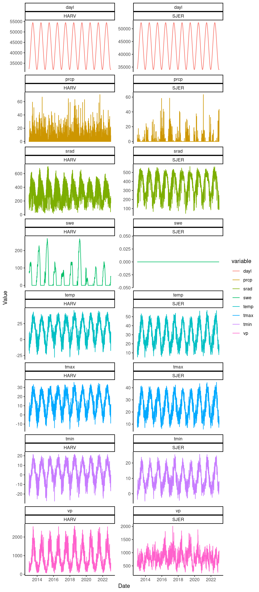

Data prepared for Dr. Yang Chen's class STATS605 in 2023 Fall, also good for others interested in exploring phenology data.

Data files and code for generating them can be found in [this GitHub repo](https://github.com/yiluansong/phenology-sample-data).

This blog gives some first steps reading and visualizing the data.


::: {.cell}
::: {.cell-output-display}

```{=html}
<iframe style="height:500px;width:100%" src="https://docs.google.com/document/d/1X65JVcC2iEuRqwa0ZyO6vMCJWHNo9WdxdO8EEEW4-RA/edit?usp=sharing"></iframe>
```

:::
:::


## Meta data for trees


::: {.cell}

```{.r .cell-code}
metadata <- read_csv("data/metadata.csv")

metadata %>%
  head() %>%
  flextable::regulartable() %>%
  flextable::autofit() %>%
  flextable::fit_to_width(8)
```

::: {.cell-output-display}

```{=html}
<div class="tabwid"><style>.cl-0e500ff6{}.cl-0e4762ac{font-family:'DejaVu Sans';font-size:8pt;font-weight:normal;font-style:normal;text-decoration:none;color:rgba(0, 0, 0, 1.00);background-color:transparent;}.cl-0e4aedc8{margin:0;text-align:left;border-bottom: 0 solid rgba(0, 0, 0, 1.00);border-top: 0 solid rgba(0, 0, 0, 1.00);border-left: 0 solid rgba(0, 0, 0, 1.00);border-right: 0 solid rgba(0, 0, 0, 1.00);padding-bottom:5pt;padding-top:5pt;padding-left:5pt;padding-right:5pt;line-height: 1;background-color:transparent;}.cl-0e4aedc9{margin:0;text-align:right;border-bottom: 0 solid rgba(0, 0, 0, 1.00);border-top: 0 solid rgba(0, 0, 0, 1.00);border-left: 0 solid rgba(0, 0, 0, 1.00);border-right: 0 solid rgba(0, 0, 0, 1.00);padding-bottom:5pt;padding-top:5pt;padding-left:5pt;padding-right:5pt;line-height: 1;background-color:transparent;}.cl-0e4b0754{width:0.498in;background-color:transparent;vertical-align: middle;border-bottom: 1.5pt solid rgba(102, 102, 102, 1.00);border-top: 1.5pt solid rgba(102, 102, 102, 1.00);border-left: 0 solid rgba(0, 0, 0, 1.00);border-right: 0 solid rgba(0, 0, 0, 1.00);margin-bottom:0;margin-top:0;margin-left:0;margin-right:0;}.cl-0e4b075e{width:0.715in;background-color:transparent;vertical-align: middle;border-bottom: 1.5pt solid rgba(102, 102, 102, 1.00);border-top: 1.5pt solid rgba(102, 102, 102, 1.00);border-left: 0 solid rgba(0, 0, 0, 1.00);border-right: 0 solid rgba(0, 0, 0, 1.00);margin-bottom:0;margin-top:0;margin-left:0;margin-right:0;}.cl-0e4b0768{width:0.755in;background-color:transparent;vertical-align: middle;border-bottom: 1.5pt solid rgba(102, 102, 102, 1.00);border-top: 1.5pt solid rgba(102, 102, 102, 1.00);border-left: 0 solid rgba(0, 0, 0, 1.00);border-right: 0 solid rgba(0, 0, 0, 1.00);margin-bottom:0;margin-top:0;margin-left:0;margin-right:0;}.cl-0e4b0769{width:1.748in;background-color:transparent;vertical-align: middle;border-bottom: 1.5pt solid rgba(102, 102, 102, 1.00);border-top: 1.5pt solid rgba(102, 102, 102, 1.00);border-left: 0 solid rgba(0, 0, 0, 1.00);border-right: 0 solid rgba(0, 0, 0, 1.00);margin-bottom:0;margin-top:0;margin-left:0;margin-right:0;}.cl-0e4b0772{width:1.115in;background-color:transparent;vertical-align: middle;border-bottom: 1.5pt solid rgba(102, 102, 102, 1.00);border-top: 1.5pt solid rgba(102, 102, 102, 1.00);border-left: 0 solid rgba(0, 0, 0, 1.00);border-right: 0 solid rgba(0, 0, 0, 1.00);margin-bottom:0;margin-top:0;margin-left:0;margin-right:0;}.cl-0e4b0773{width:1.333in;background-color:transparent;vertical-align: middle;border-bottom: 1.5pt solid rgba(102, 102, 102, 1.00);border-top: 1.5pt solid rgba(102, 102, 102, 1.00);border-left: 0 solid rgba(0, 0, 0, 1.00);border-right: 0 solid rgba(0, 0, 0, 1.00);margin-bottom:0;margin-top:0;margin-left:0;margin-right:0;}.cl-0e4b0774{width:0.498in;background-color:transparent;vertical-align: middle;border-bottom: 0 solid rgba(0, 0, 0, 1.00);border-top: 0 solid rgba(0, 0, 0, 1.00);border-left: 0 solid rgba(0, 0, 0, 1.00);border-right: 0 solid rgba(0, 0, 0, 1.00);margin-bottom:0;margin-top:0;margin-left:0;margin-right:0;}.cl-0e4b077c{width:0.715in;background-color:transparent;vertical-align: middle;border-bottom: 0 solid rgba(0, 0, 0, 1.00);border-top: 0 solid rgba(0, 0, 0, 1.00);border-left: 0 solid rgba(0, 0, 0, 1.00);border-right: 0 solid rgba(0, 0, 0, 1.00);margin-bottom:0;margin-top:0;margin-left:0;margin-right:0;}.cl-0e4b077d{width:0.755in;background-color:transparent;vertical-align: middle;border-bottom: 0 solid rgba(0, 0, 0, 1.00);border-top: 0 solid rgba(0, 0, 0, 1.00);border-left: 0 solid rgba(0, 0, 0, 1.00);border-right: 0 solid rgba(0, 0, 0, 1.00);margin-bottom:0;margin-top:0;margin-left:0;margin-right:0;}.cl-0e4b077e{width:1.748in;background-color:transparent;vertical-align: middle;border-bottom: 0 solid rgba(0, 0, 0, 1.00);border-top: 0 solid rgba(0, 0, 0, 1.00);border-left: 0 solid rgba(0, 0, 0, 1.00);border-right: 0 solid rgba(0, 0, 0, 1.00);margin-bottom:0;margin-top:0;margin-left:0;margin-right:0;}.cl-0e4b0786{width:1.115in;background-color:transparent;vertical-align: middle;border-bottom: 0 solid rgba(0, 0, 0, 1.00);border-top: 0 solid rgba(0, 0, 0, 1.00);border-left: 0 solid rgba(0, 0, 0, 1.00);border-right: 0 solid rgba(0, 0, 0, 1.00);margin-bottom:0;margin-top:0;margin-left:0;margin-right:0;}.cl-0e4b0787{width:1.333in;background-color:transparent;vertical-align: middle;border-bottom: 0 solid rgba(0, 0, 0, 1.00);border-top: 0 solid rgba(0, 0, 0, 1.00);border-left: 0 solid rgba(0, 0, 0, 1.00);border-right: 0 solid rgba(0, 0, 0, 1.00);margin-bottom:0;margin-top:0;margin-left:0;margin-right:0;}.cl-0e4b0788{width:0.498in;background-color:transparent;vertical-align: middle;border-bottom: 1.5pt solid rgba(102, 102, 102, 1.00);border-top: 0 solid rgba(0, 0, 0, 1.00);border-left: 0 solid rgba(0, 0, 0, 1.00);border-right: 0 solid rgba(0, 0, 0, 1.00);margin-bottom:0;margin-top:0;margin-left:0;margin-right:0;}.cl-0e4b0790{width:0.715in;background-color:transparent;vertical-align: middle;border-bottom: 1.5pt solid rgba(102, 102, 102, 1.00);border-top: 0 solid rgba(0, 0, 0, 1.00);border-left: 0 solid rgba(0, 0, 0, 1.00);border-right: 0 solid rgba(0, 0, 0, 1.00);margin-bottom:0;margin-top:0;margin-left:0;margin-right:0;}.cl-0e4b0791{width:0.755in;background-color:transparent;vertical-align: middle;border-bottom: 1.5pt solid rgba(102, 102, 102, 1.00);border-top: 0 solid rgba(0, 0, 0, 1.00);border-left: 0 solid rgba(0, 0, 0, 1.00);border-right: 0 solid rgba(0, 0, 0, 1.00);margin-bottom:0;margin-top:0;margin-left:0;margin-right:0;}.cl-0e4b079a{width:1.748in;background-color:transparent;vertical-align: middle;border-bottom: 1.5pt solid rgba(102, 102, 102, 1.00);border-top: 0 solid rgba(0, 0, 0, 1.00);border-left: 0 solid rgba(0, 0, 0, 1.00);border-right: 0 solid rgba(0, 0, 0, 1.00);margin-bottom:0;margin-top:0;margin-left:0;margin-right:0;}.cl-0e4b079b{width:1.115in;background-color:transparent;vertical-align: middle;border-bottom: 1.5pt solid rgba(102, 102, 102, 1.00);border-top: 0 solid rgba(0, 0, 0, 1.00);border-left: 0 solid rgba(0, 0, 0, 1.00);border-right: 0 solid rgba(0, 0, 0, 1.00);margin-bottom:0;margin-top:0;margin-left:0;margin-right:0;}.cl-0e4b07a4{width:1.333in;background-color:transparent;vertical-align: middle;border-bottom: 1.5pt solid rgba(102, 102, 102, 1.00);border-top: 0 solid rgba(0, 0, 0, 1.00);border-left: 0 solid rgba(0, 0, 0, 1.00);border-right: 0 solid rgba(0, 0, 0, 1.00);margin-bottom:0;margin-top:0;margin-left:0;margin-right:0;}</style><table data-quarto-disable-processing='true' class='cl-0e500ff6'><thead><tr style="overflow-wrap:break-word;"><th class="cl-0e4b0754"><p class="cl-0e4aedc8"><span class="cl-0e4762ac">site</span></p></th><th class="cl-0e4b075e"><p class="cl-0e4aedc9"><span class="cl-0e4762ac">site_lat</span></p></th><th class="cl-0e4b0768"><p class="cl-0e4aedc9"><span class="cl-0e4762ac">site_lon</span></p></th><th class="cl-0e4b0769"><p class="cl-0e4aedc8"><span class="cl-0e4762ac">id</span></p></th><th class="cl-0e4b075e"><p class="cl-0e4aedc9"><span class="cl-0e4762ac">lat</span></p></th><th class="cl-0e4b0768"><p class="cl-0e4aedc9"><span class="cl-0e4762ac">lon</span></p></th><th class="cl-0e4b0772"><p class="cl-0e4aedc8"><span class="cl-0e4762ac">species</span></p></th><th class="cl-0e4b0773"><p class="cl-0e4aedc8"><span class="cl-0e4762ac">growth_form</span></p></th></tr></thead><tbody><tr style="overflow-wrap:break-word;"><td class="cl-0e4b0774"><p class="cl-0e4aedc8"><span class="cl-0e4762ac">HARV</span></p></td><td class="cl-0e4b077c"><p class="cl-0e4aedc9"><span class="cl-0e4762ac">42.54278</span></p></td><td class="cl-0e4b077d"><p class="cl-0e4aedc9"><span class="cl-0e4762ac">-72.17213</span></p></td><td class="cl-0e4b077e"><p class="cl-0e4aedc8"><span class="cl-0e4762ac">NEON.PLA.D01.HARV.06016</span></p></td><td class="cl-0e4b077c"><p class="cl-0e4aedc9"><span class="cl-0e4762ac">42.54368</span></p></td><td class="cl-0e4b077d"><p class="cl-0e4aedc9"><span class="cl-0e4762ac">-72.17330</span></p></td><td class="cl-0e4b0786"><p class="cl-0e4aedc8"><span class="cl-0e4762ac">Quercus rubra L.</span></p></td><td class="cl-0e4b0787"><p class="cl-0e4aedc8"><span class="cl-0e4762ac">Deciduous broadleaf</span></p></td></tr><tr style="overflow-wrap:break-word;"><td class="cl-0e4b0774"><p class="cl-0e4aedc8"><span class="cl-0e4762ac">HARV</span></p></td><td class="cl-0e4b077c"><p class="cl-0e4aedc9"><span class="cl-0e4762ac">42.54278</span></p></td><td class="cl-0e4b077d"><p class="cl-0e4aedc9"><span class="cl-0e4762ac">-72.17213</span></p></td><td class="cl-0e4b077e"><p class="cl-0e4aedc8"><span class="cl-0e4762ac">NEON.PLA.D01.HARV.06046</span></p></td><td class="cl-0e4b077c"><p class="cl-0e4aedc9"><span class="cl-0e4762ac">42.54186</span></p></td><td class="cl-0e4b077d"><p class="cl-0e4aedc9"><span class="cl-0e4762ac">-72.17096</span></p></td><td class="cl-0e4b0786"><p class="cl-0e4aedc8"><span class="cl-0e4762ac">Quercus rubra L.</span></p></td><td class="cl-0e4b0787"><p class="cl-0e4aedc8"><span class="cl-0e4762ac">Deciduous broadleaf</span></p></td></tr><tr style="overflow-wrap:break-word;"><td class="cl-0e4b0774"><p class="cl-0e4aedc8"><span class="cl-0e4762ac">HARV</span></p></td><td class="cl-0e4b077c"><p class="cl-0e4aedc9"><span class="cl-0e4762ac">42.54278</span></p></td><td class="cl-0e4b077d"><p class="cl-0e4aedc9"><span class="cl-0e4762ac">-72.17213</span></p></td><td class="cl-0e4b077e"><p class="cl-0e4aedc8"><span class="cl-0e4762ac">NEON.PLA.D01.HARV.06034</span></p></td><td class="cl-0e4b077c"><p class="cl-0e4aedc9"><span class="cl-0e4762ac">42.54310</span></p></td><td class="cl-0e4b077d"><p class="cl-0e4aedc9"><span class="cl-0e4762ac">-72.17097</span></p></td><td class="cl-0e4b0786"><p class="cl-0e4aedc8"><span class="cl-0e4762ac">Quercus rubra L.</span></p></td><td class="cl-0e4b0787"><p class="cl-0e4aedc8"><span class="cl-0e4762ac">Deciduous broadleaf</span></p></td></tr><tr style="overflow-wrap:break-word;"><td class="cl-0e4b0774"><p class="cl-0e4aedc8"><span class="cl-0e4762ac">HARV</span></p></td><td class="cl-0e4b077c"><p class="cl-0e4aedc9"><span class="cl-0e4762ac">42.54278</span></p></td><td class="cl-0e4b077d"><p class="cl-0e4aedc9"><span class="cl-0e4762ac">-72.17213</span></p></td><td class="cl-0e4b077e"><p class="cl-0e4aedc8"><span class="cl-0e4762ac">NEON.PLA.D01.HARV.06041</span></p></td><td class="cl-0e4b077c"><p class="cl-0e4aedc9"><span class="cl-0e4762ac">42.54225</span></p></td><td class="cl-0e4b077d"><p class="cl-0e4aedc9"><span class="cl-0e4762ac">-72.17102</span></p></td><td class="cl-0e4b0786"><p class="cl-0e4aedc8"><span class="cl-0e4762ac">Quercus rubra L.</span></p></td><td class="cl-0e4b0787"><p class="cl-0e4aedc8"><span class="cl-0e4762ac">Deciduous broadleaf</span></p></td></tr><tr style="overflow-wrap:break-word;"><td class="cl-0e4b0774"><p class="cl-0e4aedc8"><span class="cl-0e4762ac">HARV</span></p></td><td class="cl-0e4b077c"><p class="cl-0e4aedc9"><span class="cl-0e4762ac">42.54278</span></p></td><td class="cl-0e4b077d"><p class="cl-0e4aedc9"><span class="cl-0e4762ac">-72.17213</span></p></td><td class="cl-0e4b077e"><p class="cl-0e4aedc8"><span class="cl-0e4762ac">NEON.PLA.D01.HARV.06039</span></p></td><td class="cl-0e4b077c"><p class="cl-0e4aedc9"><span class="cl-0e4762ac">42.54233</span></p></td><td class="cl-0e4b077d"><p class="cl-0e4aedc9"><span class="cl-0e4762ac">-72.17089</span></p></td><td class="cl-0e4b0786"><p class="cl-0e4aedc8"><span class="cl-0e4762ac">Quercus rubra L.</span></p></td><td class="cl-0e4b0787"><p class="cl-0e4aedc8"><span class="cl-0e4762ac">Deciduous broadleaf</span></p></td></tr><tr style="overflow-wrap:break-word;"><td class="cl-0e4b0788"><p class="cl-0e4aedc8"><span class="cl-0e4762ac">HARV</span></p></td><td class="cl-0e4b0790"><p class="cl-0e4aedc9"><span class="cl-0e4762ac">42.54278</span></p></td><td class="cl-0e4b0791"><p class="cl-0e4aedc9"><span class="cl-0e4762ac">-72.17213</span></p></td><td class="cl-0e4b079a"><p class="cl-0e4aedc8"><span class="cl-0e4762ac">NEON.PLA.D01.HARV.06029</span></p></td><td class="cl-0e4b0790"><p class="cl-0e4aedc9"><span class="cl-0e4762ac">42.54373</span></p></td><td class="cl-0e4b0791"><p class="cl-0e4aedc9"><span class="cl-0e4762ac">-72.17132</span></p></td><td class="cl-0e4b079b"><p class="cl-0e4aedc8"><span class="cl-0e4762ac">Quercus rubra L.</span></p></td><td class="cl-0e4b07a4"><p class="cl-0e4aedc8"><span class="cl-0e4762ac">Deciduous broadleaf</span></p></td></tr></tbody></table></div>
```

:::
:::

::: {.cell}

```{.r .cell-code}
metadata %>%
  ggplot() +
  geom_point(aes(x = lon, y = lat, col = species)) +
  facet_wrap(. ~ site, scales = "free") +
  theme_minimal() +
  theme(legend.position = "bottom") +
  guides(col = "none") +
  labs(
    x = "Longitude",
    y = "Latitude"
  )
```

::: {.cell-output-display}
{width=672}
:::
:::


## Discrete phenology data. 


::: {.cell}

```{.r .cell-code}
rnpn::npn_pheno_classes() %>%
  filter(id %in% 1:5) %>%
  select(id, name, description) %>%
  flextable::regulartable() %>%
  flextable::autofit() %>%
  flextable::fit_to_width(8)
```

::: {.cell-output-display}

```{=html}
<div class="tabwid"><style>.cl-0f2931fa{}.cl-0f228512{font-family:'DejaVu Sans';font-size:11pt;font-weight:normal;font-style:normal;text-decoration:none;color:rgba(0, 0, 0, 1.00);background-color:transparent;}.cl-0f2561d8{margin:0;text-align:right;border-bottom: 0 solid rgba(0, 0, 0, 1.00);border-top: 0 solid rgba(0, 0, 0, 1.00);border-left: 0 solid rgba(0, 0, 0, 1.00);border-right: 0 solid rgba(0, 0, 0, 1.00);padding-bottom:5pt;padding-top:5pt;padding-left:5pt;padding-right:5pt;line-height: 1;background-color:transparent;}.cl-0f2561e2{margin:0;text-align:left;border-bottom: 0 solid rgba(0, 0, 0, 1.00);border-top: 0 solid rgba(0, 0, 0, 1.00);border-left: 0 solid rgba(0, 0, 0, 1.00);border-right: 0 solid rgba(0, 0, 0, 1.00);padding-bottom:5pt;padding-top:5pt;padding-left:5pt;padding-right:5pt;line-height: 1;background-color:transparent;}.cl-0f2575ba{width:0.425in;background-color:transparent;vertical-align: middle;border-bottom: 1.5pt solid rgba(102, 102, 102, 1.00);border-top: 1.5pt solid rgba(102, 102, 102, 1.00);border-left: 0 solid rgba(0, 0, 0, 1.00);border-right: 0 solid rgba(0, 0, 0, 1.00);margin-bottom:0;margin-top:0;margin-left:0;margin-right:0;}.cl-0f2575bb{width:2.301in;background-color:transparent;vertical-align: middle;border-bottom: 1.5pt solid rgba(102, 102, 102, 1.00);border-top: 1.5pt solid rgba(102, 102, 102, 1.00);border-left: 0 solid rgba(0, 0, 0, 1.00);border-right: 0 solid rgba(0, 0, 0, 1.00);margin-bottom:0;margin-top:0;margin-left:0;margin-right:0;}.cl-0f2575c4{width:3.829in;background-color:transparent;vertical-align: middle;border-bottom: 1.5pt solid rgba(102, 102, 102, 1.00);border-top: 1.5pt solid rgba(102, 102, 102, 1.00);border-left: 0 solid rgba(0, 0, 0, 1.00);border-right: 0 solid rgba(0, 0, 0, 1.00);margin-bottom:0;margin-top:0;margin-left:0;margin-right:0;}.cl-0f2575c5{width:0.425in;background-color:transparent;vertical-align: middle;border-bottom: 0 solid rgba(0, 0, 0, 1.00);border-top: 0 solid rgba(0, 0, 0, 1.00);border-left: 0 solid rgba(0, 0, 0, 1.00);border-right: 0 solid rgba(0, 0, 0, 1.00);margin-bottom:0;margin-top:0;margin-left:0;margin-right:0;}.cl-0f2575ce{width:2.301in;background-color:transparent;vertical-align: middle;border-bottom: 0 solid rgba(0, 0, 0, 1.00);border-top: 0 solid rgba(0, 0, 0, 1.00);border-left: 0 solid rgba(0, 0, 0, 1.00);border-right: 0 solid rgba(0, 0, 0, 1.00);margin-bottom:0;margin-top:0;margin-left:0;margin-right:0;}.cl-0f2575cf{width:3.829in;background-color:transparent;vertical-align: middle;border-bottom: 0 solid rgba(0, 0, 0, 1.00);border-top: 0 solid rgba(0, 0, 0, 1.00);border-left: 0 solid rgba(0, 0, 0, 1.00);border-right: 0 solid rgba(0, 0, 0, 1.00);margin-bottom:0;margin-top:0;margin-left:0;margin-right:0;}.cl-0f2575d8{width:0.425in;background-color:transparent;vertical-align: middle;border-bottom: 1.5pt solid rgba(102, 102, 102, 1.00);border-top: 0 solid rgba(0, 0, 0, 1.00);border-left: 0 solid rgba(0, 0, 0, 1.00);border-right: 0 solid rgba(0, 0, 0, 1.00);margin-bottom:0;margin-top:0;margin-left:0;margin-right:0;}.cl-0f2575d9{width:2.301in;background-color:transparent;vertical-align: middle;border-bottom: 1.5pt solid rgba(102, 102, 102, 1.00);border-top: 0 solid rgba(0, 0, 0, 1.00);border-left: 0 solid rgba(0, 0, 0, 1.00);border-right: 0 solid rgba(0, 0, 0, 1.00);margin-bottom:0;margin-top:0;margin-left:0;margin-right:0;}.cl-0f2575e2{width:3.829in;background-color:transparent;vertical-align: middle;border-bottom: 1.5pt solid rgba(102, 102, 102, 1.00);border-top: 0 solid rgba(0, 0, 0, 1.00);border-left: 0 solid rgba(0, 0, 0, 1.00);border-right: 0 solid rgba(0, 0, 0, 1.00);margin-bottom:0;margin-top:0;margin-left:0;margin-right:0;}</style><table data-quarto-disable-processing='true' class='cl-0f2931fa'><thead><tr style="overflow-wrap:break-word;"><th class="cl-0f2575ba"><p class="cl-0f2561d8"><span class="cl-0f228512">id</span></p></th><th class="cl-0f2575bb"><p class="cl-0f2561e2"><span class="cl-0f228512">name</span></p></th><th class="cl-0f2575c4"><p class="cl-0f2561e2"><span class="cl-0f228512">description</span></p></th></tr></thead><tbody><tr style="overflow-wrap:break-word;"><td class="cl-0f2575c5"><p class="cl-0f2561d8"><span class="cl-0f228512">1</span></p></td><td class="cl-0f2575ce"><p class="cl-0f2561e2"><span class="cl-0f228512">Initial shoot or leaf growth</span></p></td><td class="cl-0f2575cf"><p class="cl-0f2561e2"><span class="cl-0f228512">Initiation of seasonal vegetative growth</span></p></td></tr><tr style="overflow-wrap:break-word;"><td class="cl-0f2575c5"><p class="cl-0f2561d8"><span class="cl-0f228512">2</span></p></td><td class="cl-0f2575ce"><p class="cl-0f2561e2"><span class="cl-0f228512">Young leaves or needles</span></p></td><td class="cl-0f2575cf"><p class="cl-0f2561e2"><span class="cl-0f228512">Presence of foliage still in process of maturing</span></p></td></tr><tr style="overflow-wrap:break-word;"><td class="cl-0f2575c5"><p class="cl-0f2561d8"><span class="cl-0f228512">3</span></p></td><td class="cl-0f2575ce"><p class="cl-0f2561e2"><span class="cl-0f228512">Leaves or needles</span></p></td><td class="cl-0f2575cf"><p class="cl-0f2561e2"><span class="cl-0f228512">Presence of live foliage</span></p></td></tr><tr style="overflow-wrap:break-word;"><td class="cl-0f2575c5"><p class="cl-0f2561d8"><span class="cl-0f228512">4</span></p></td><td class="cl-0f2575ce"><p class="cl-0f2561e2"><span class="cl-0f228512">Colored leaves or needles</span></p></td><td class="cl-0f2575cf"><p class="cl-0f2561e2"><span class="cl-0f228512">Senescent coloring of foliage</span></p></td></tr><tr style="overflow-wrap:break-word;"><td class="cl-0f2575d8"><p class="cl-0f2561d8"><span class="cl-0f228512">5</span></p></td><td class="cl-0f2575d9"><p class="cl-0f2561e2"><span class="cl-0f228512">Falling leaves or needles</span></p></td><td class="cl-0f2575e2"><p class="cl-0f2561e2"><span class="cl-0f228512">Dropping of foliage</span></p></td></tr></tbody></table></div>
```

:::
:::

::: {.cell}

```{.r .cell-code}
dat_discrete <- read_csv("data/discrete.csv")

dat_discrete %>%
  filter(status == "yes") %>%
  mutate(doy = date %>% lubridate::mdy() %>% lubridate::yday()) %>%
  arrange(phenophase_code) %>%
  mutate(phenophase = factor(phenophase, levels = unique(phenophase))) %>%
  ggplot() +
  geom_segment(aes(x = doy, xend = doy, y = 0, yend = 1), alpha = 0.01, col = "dark green") +
  facet_wrap(. ~ phenophase * site, ncol = 2) +
  theme_classic() +
  labs(
    x = "Day of year",
    y = ""
  ) +
  theme(axis.title.y = element_blank())
```

::: {.cell-output-display}
{width=672}
:::
:::

::: {.cell}

```{.r .cell-code}
dat_discrete <- read_csv("data/discrete.csv")

dat_discrete %>%
  filter(!is.na(intensity)) %>%
  mutate(doy = date %>% lubridate::mdy() %>% lubridate::yday()) %>%
  arrange(phenophase_code) %>%
  mutate(phenophase = factor(phenophase, levels = unique(phenophase))) %>%
  arrange(intensity_code) %>%
  mutate(intensity = factor(intensity, levels = unique(intensity))) %>%
  ggplot() +
  geom_point(aes(x = doy, y = intensity), alpha = 0.01, col = "dark green") +
  facet_wrap(. ~ phenophase * site, ncol = 2) +
  theme_classic() +
  labs(
    x = "Day of year",
    y = "Intensity"
  )
```

::: {.cell-output-display}
{width=672}
:::
:::


## Continuous phenology data


::: {.cell}

```{.r .cell-code}
dat_continuous_3m <- read_csv("data/continuous_3m.csv")

dat_continuous_3m %>%
  ggplot() +
  geom_line(aes(x = date, y = evi, group = id), alpha = 0.01, col = "dark green") +
  facet_wrap(. ~ site) +
  theme_classic() +
  labs(
    x = "Date",
    y = "EVI"
  )
```

::: {.cell-output-display}
{width=672}
:::
:::

::: {.cell}

```{.r .cell-code}
dat_continuous_500m <- read_csv("data/continuous_500m.csv")

dat_continuous_500m %>%
  ggplot() +
  geom_line(aes(x = date, y = evi), col = "dark green") +
  facet_wrap(. ~ site) +
  theme_classic() +
  labs(
    x = "Date",
    y = "EVI"
  )
```

::: {.cell-output-display}
{width=672}
:::
:::


## Weather data


::: {.cell}

```{.r .cell-code}
dat_weather <- read_csv("data/weather.csv")

dat_weather %>%
  gather(key = "variable", value = "value", -site, -date) %>%
  ggplot() +
  geom_line(aes(x = date, y = value, col = variable)) +
  facet_wrap(. ~ variable * site, scales = "free_y", ncol = 2) +
  theme_classic() +
  labs(
    x = "Date",
    y = "Value"
  )
```

::: {.cell-output-display}
{width=672}
:::
:::

