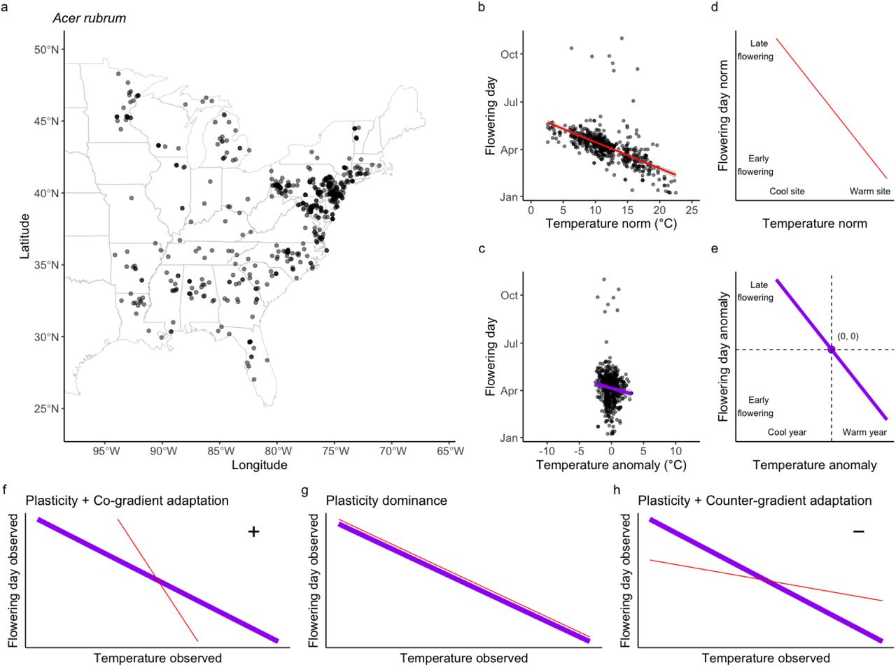
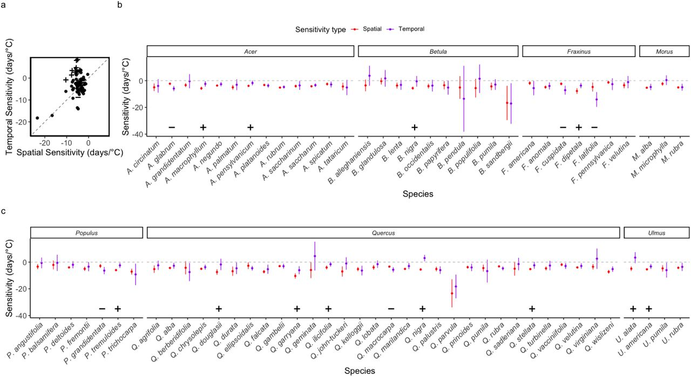

## Highlights

- **Climate change is shifting the flowering phenology of wind-pollinated trees. It is key quantify the sensitivity and understand the mechanisms of these phenological responses.**
- **We investigated the temperature sensitivity of flowering phenology in 74 wind-pollinated tree species across the US using long-term herbarium records spanning over a century.**
- **We compared spatial and temporal sensitivities in multiple wind-pollinated species to evaluate the roles of plasticity and adaptation in phenological responses of flowering.**

---

## Comparing spatial and temporal sensitivities

