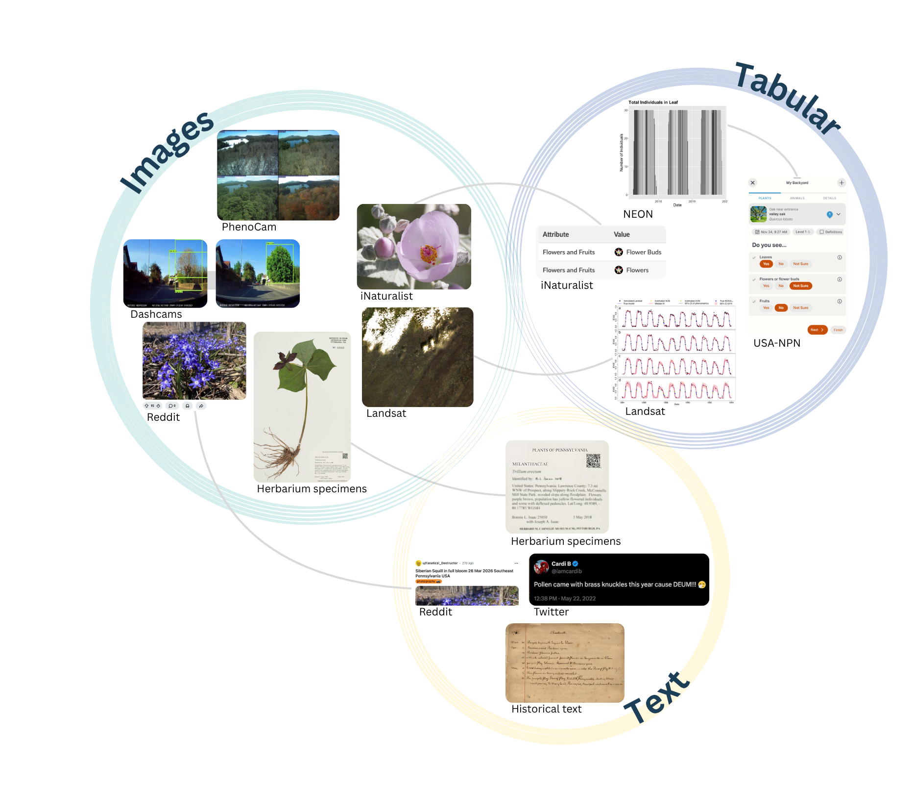
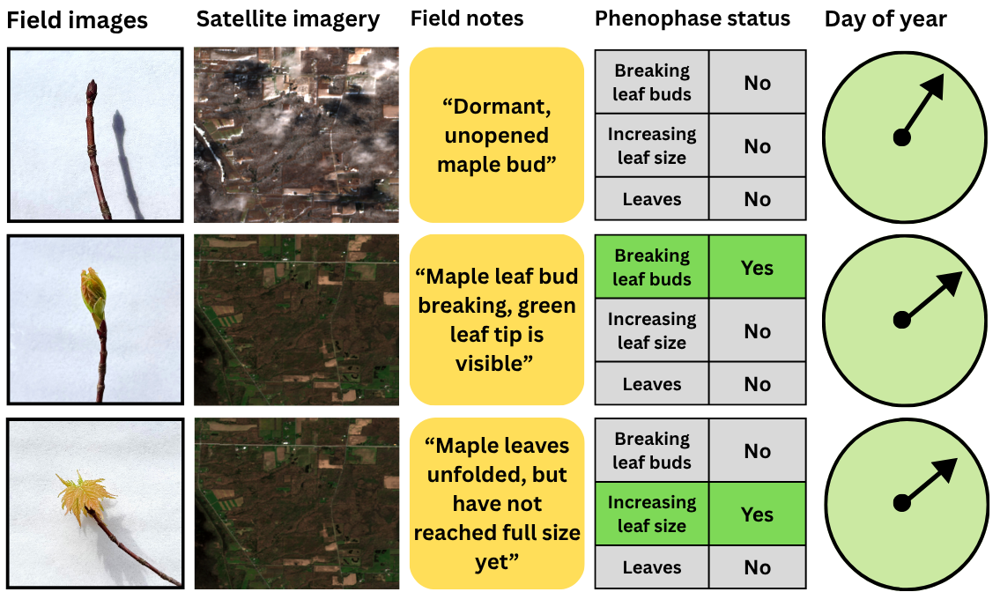
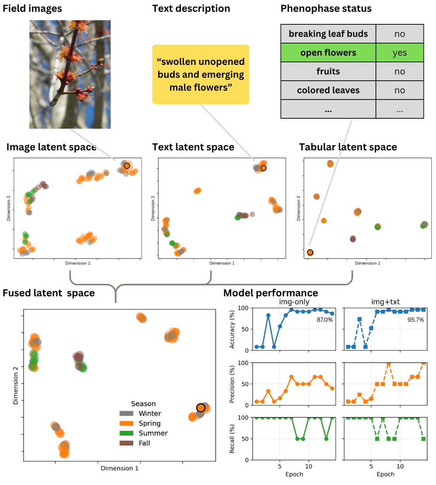

## Abstract

Earth's biological clock is losing synchrony: spring arrives earlier, but not all organisms keep pace. Every day, billions of observations accumulate across satellites, herbarium collections, and smartphones, yet these data streams remain siloed and incompatible, preventing the integrated understanding we urgently need. We propose SeasonFM, a multimodal foundation model. By learning any-to-any translation across images, text, and tabular observations, SeasonFM synthesizes Earth's diverse seasonal data into a unified biological clock, enabling researchers to reconstruct centuries of seasonal change, mobilize previously untapped data sources, and forecast the consequences of disrupted synchrony for biodiversity and human well-being.

------------------------------------------------------------------------

## Multimodal data on seasonality

Earth's seasonality is observed through an extraordinary diversity of data sources, from satellites orbiting hundreds of kilometers above to citizen scientists photographing flowers on their morning walks. These sources span images (satellite imagery, PhenoCam canopy photos, digitized herbarium specimens, iNaturalist field photos, dashcam footage), text (field notes, photo captions, historical literature, social media posts), and tabular records (phenophase status, image labels, time series of vegetation indices). Each source captures a different facet of seasonal change, at different scales and levels of detail. SeasonFM is designed to learn from these data streams simultaneously and to learn the relationships between them.

## Our fully-annotated training data

Rigorous evaluation of a multimodal model requires ground truth data where every modality is simultaneously observed, a combination rarely available in phenology research. Therefore, we are generating a high-quality fully-annotated dataset including field images, satellite imagery, field notes, and detailed phenophase status labels for 25 trees observed weekly. This effort provides the clean, well-controlled data needed to validate SeasonFM's approach for cross-modal predictions before scaling.

## Proposed model architecture

SeasonFM will take images, text, and tabular observations as inputs, each processed by a dedicated encoder: a Vision Transformer for images, a BERT-like transformer for text, and an MLP for tabular data. The resulting token sequences are concatenated and passed through a deep fusion transformer, which learns to integrate information across all modalities through full self-attention. The model is trained with contrastive, predictive, and generative loss objectives, and produces a fused embedding that captures high-dimensional seasonal information. A custom circular loss function ensures the model correctly represents the cyclical nature of calendar time.

## Proof of concept

As a first test of SeasonFM's core idea, we trained a simplified model using a frozen CLIP backbone and a shallow fusion transformer on a small tri-modal dataset of plant images from the [USA-NPN Plant Phenophases Gallery](https://usa-npn.smugmug.com/USA-NPN-Plant-Phenophases-Gallery), text descriptions, and binary phenophase status records. The model produced clear seasonal clustering in both modality-specific and fused latent spaces, confirming that meaningful seasonal representations emerge from multimodal training. Notably, images and text data contain richer details that are not captured by tabular data, such as whether the flowers are male or female, which might have distinct seasonality. The simplified model reached 87.0% and 95.7% accuracy in predicting the status of "open flowers" from images alone and from images and texts, respectively.

## Use case: forecasting pollen concentration

## Use case: reconstruct earth’s seasonality

<video autoplay loop muted playsinline width="100%">
  <source src="6.mp4" type="video/mp4">
</video>

::: {.figure-caption}
Monet's water lily pond across seasons, generated by Google Flow. Current generative AI models produce vivid seasonal scenes but often misrepresent the seasonality of organisms, a gap that SeasonFM could help bridge.
:::

