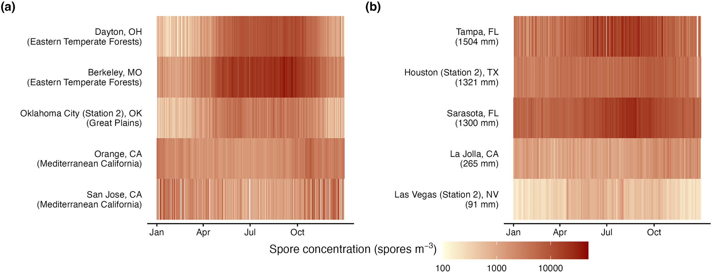
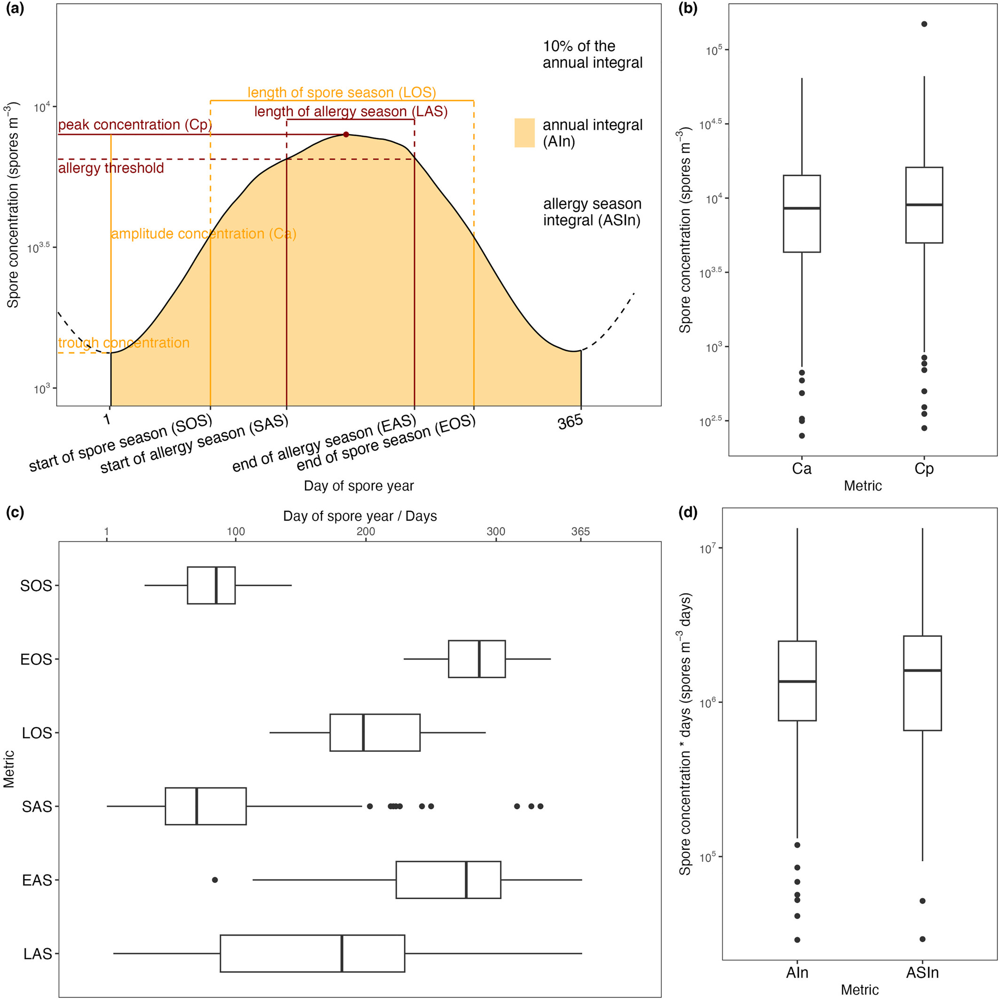
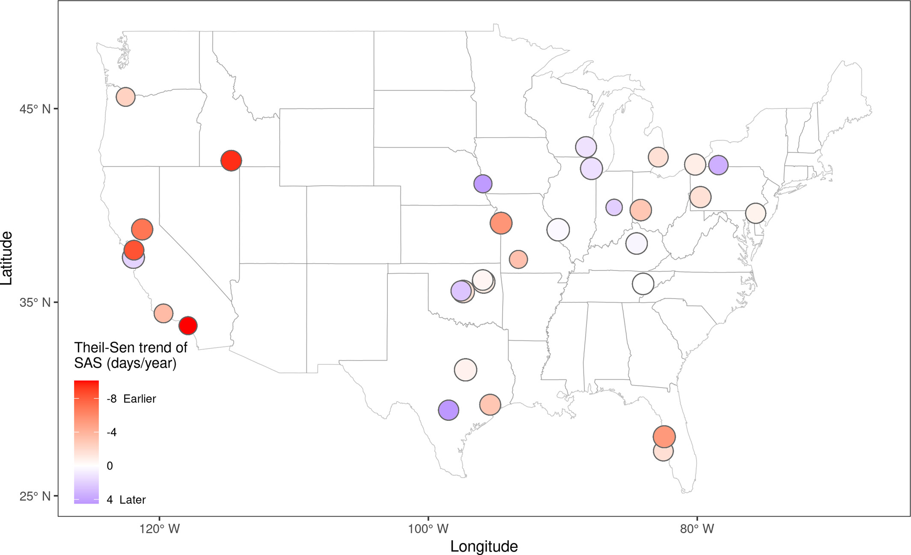
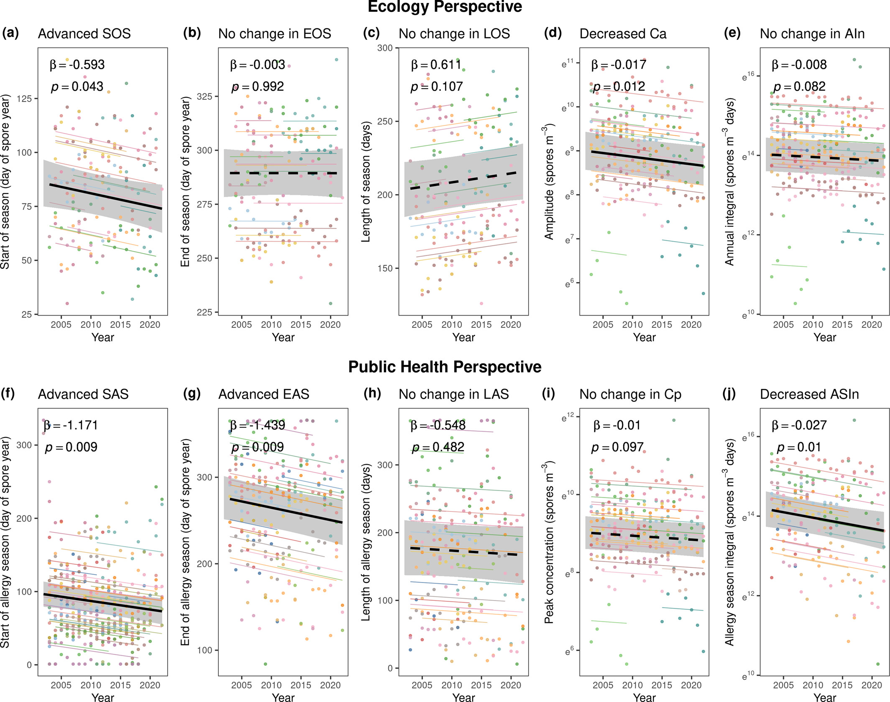
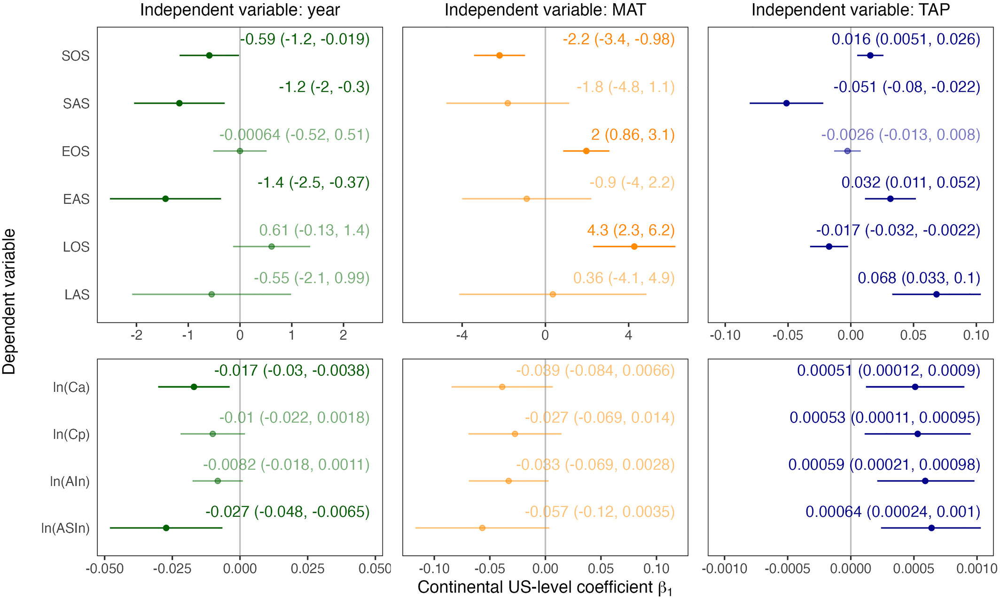

## Highlights

-   **In the United States, the onsets of both ecological and allergenic fungal spore seasons advanced from 2003 to 2022, with declined intensity.**
-   **Earlier onset of ecological spore seasons was correlated with higher temperature and lower precipitation.**
-   **Lower intensity of spore season was correlated with lower precipitation levels.**

------------------------------------------------------------------------

## Abstract

Phenological shifts due to climate change have been extensively studied in plants and animals. Yet, the responses of fungal spores—organisms important to ecosystems and major airborne allergens—remain understudied. This knowledge gap limits our understanding of their ecological and public health implications. To address this, we analyzed a long-term (2003–2022), large-scale (the continental US) data set of airborne fungal spores collected by the US National Allergy Bureau. We first pre-processed the spore data by gap-filling and smoothing. Afterward, we extracted 10 metrics describing the phenology (e.g., start and end of season) and intensity (e.g., peak concentration and integral) of fungal spore seasons. These metrics were derived using two complementary but not mutually exclusive approaches—ecological and public health approaches, defined as percentiles of total spore concentration and allergenic thresholds of spore concentration, respectively. Using linear mixed-effects models, we quantified annual shifts in these metrics across the continental US. We revealed a significant advancement in the onset of the spore seasons defined in both ecological (11 days, 95% confidence interval: 0.4–23 days) and public health (22 days, 6–38 days) approaches over two decades. Meanwhile, total spore concentrations in an annual cycle and in a spore allergy season tended to decrease over time. The earlier start of the spore season was significantly correlated with climatic variables, such as warmer temperatures and altered precipitations. Overall, our findings suggest possible climate-driven advanced fungal spore seasons, highlighting the importance of climate change mitigation and adaptation in public health decision-making.

------------------------------------------------------------------------

## Characterizing fungal spore seasons

## Shifts in fungal spore seasons

## Relationship with climatic factors

