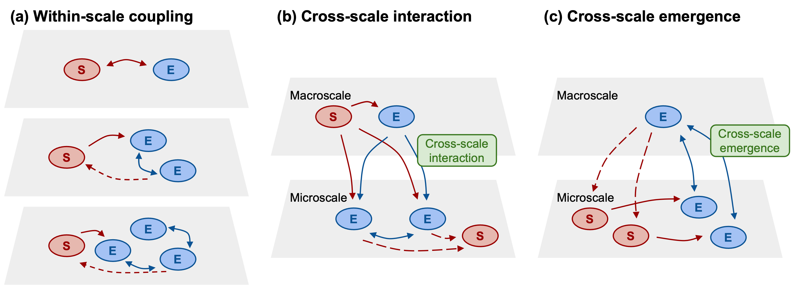
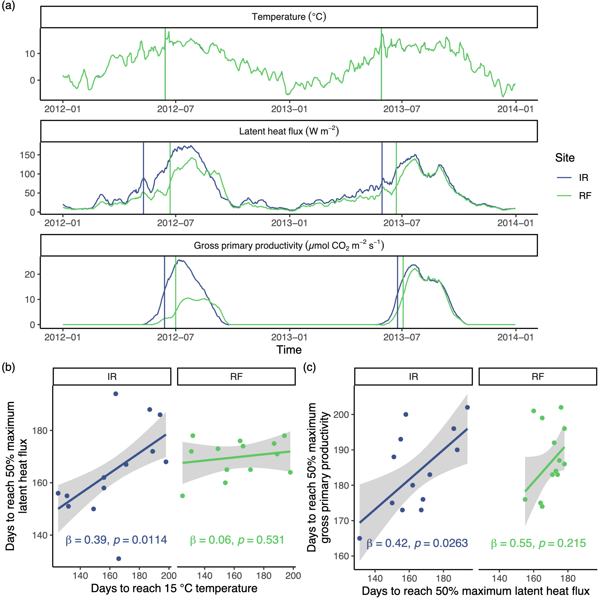
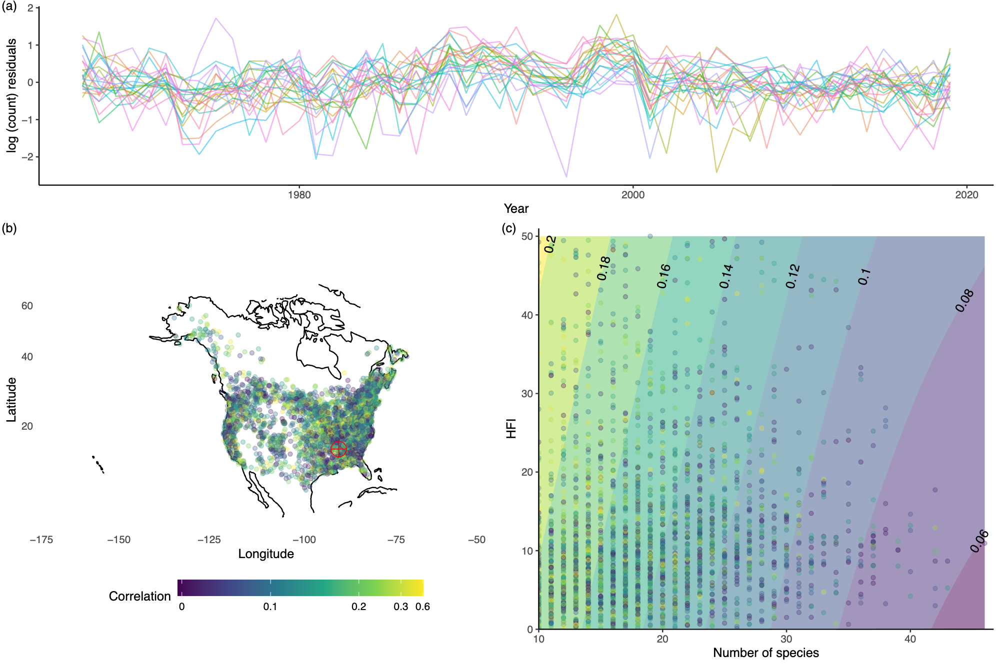
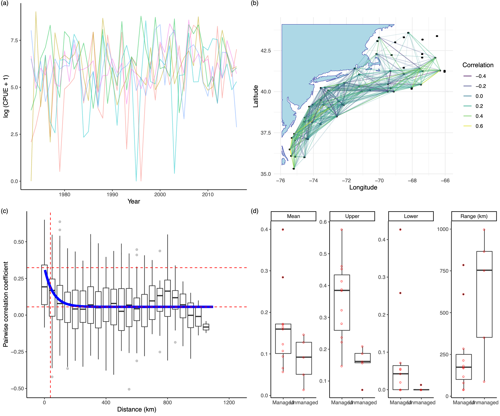
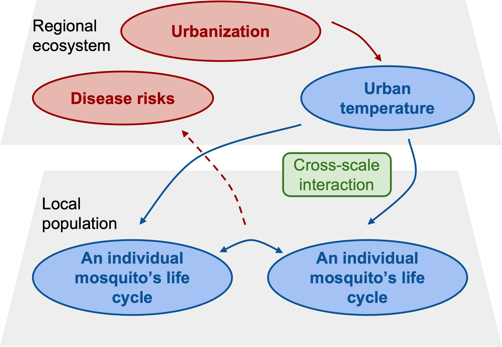
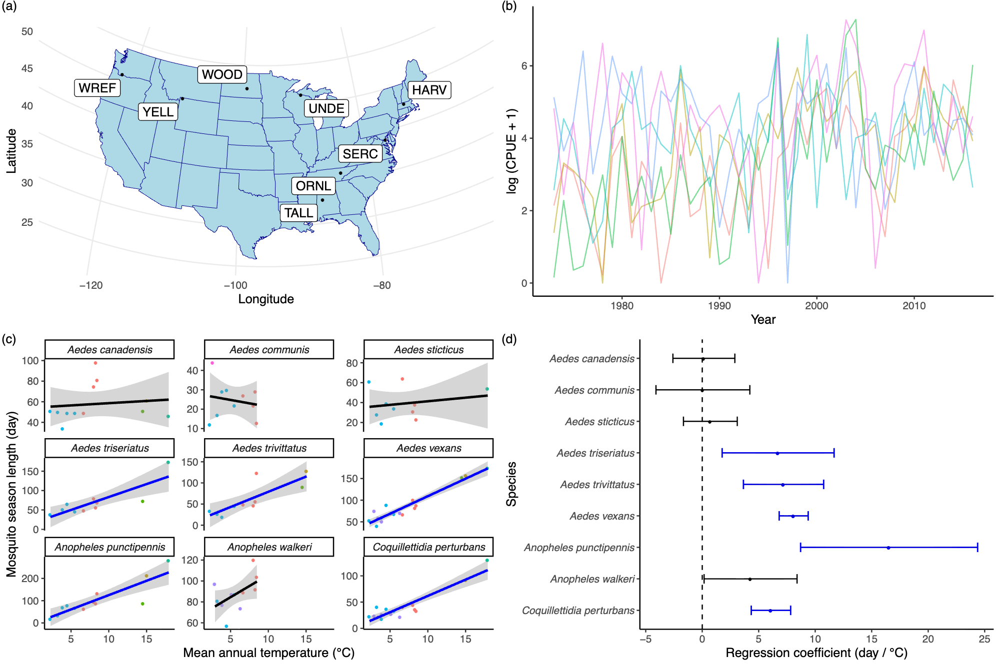

## Highlights

-   **We conducted a literature review to show human activities beyond climate change have the potential to disrupt or enhance ecological synchrony across levels of organization.**
-   **We used four case studies to demonstrate ways to quantify the impacts of human modifications on synchrony on large scales using big data.**

------------------------------------------------------------------------

## Abstract

Different aspects of ecological systems, biotic or abiotic, often fluctuate in coordinated patterns over space and time. Such high concordance between ecological processes is often referred to as ecological synchrony. Human activities, including and beyond climate change, have the potential to alter ecological synchrony by disrupting or enhancing existing synchrony. However, most studies have focused on single scales, limiting our understanding of how human activities alter ecological synchrony across spatial, temporal, and organizational scales. With a social-ecological macrosystems framework, we review how human activities, particularly beyond climate change, alter ecological synchrony from the ecosystem level to the population level. For each level, we present a case study that characterizes the roles of human agents in synchrony using data from large-scale observations. We found that human activities alter ecological synchrony through interactions among drivers on multiple scales, often disrupting synchrony, but that adaptive management can maintain or restore synchrony. Human activities potentially modify cascades of synchrony through cross-scale interactions and cross-scale emergence. Finally, we recommended a set of questions to facilitate the explicit consideration of ecological synchrony as a target in sustainable management.

------------------------------------------------------------------------

## The overlooked human dimension of ecological synchrony

## A social-ecological macrosystems framework

## Understanding human modification with the framework and big data

**Ecosystem level**

 **Community level**

  **Meta-population level**

  **Population level**

 
