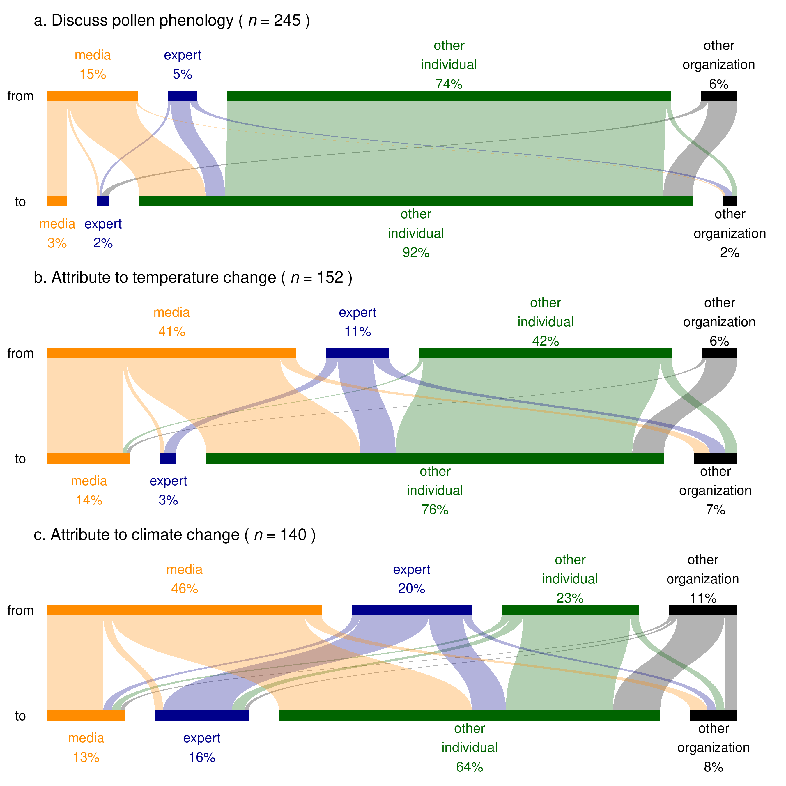

## Highlights

-   **Pollen-related Twitter posts correspond to pollen seasons over time and space.**
-   **Twitter users' attribution of changes in pollen seasons depend on their ideology.**
-   **More liberal users are more likely to agree with climate impacts on pollen seasons.**
-   **Media and experts play key roles in communicating climate impacts on pollen seasons.**

---

## Abstract

Climate change is altering the timing and intensity of pollen seasons, increasing human exposure to allergenic pollen. Climate-driven changes in pollen seasons present a unique opportunity to craft messaging that communicates how climate change is affecting biological systems. However, it is unclear how pollen seasons are experienced and understood by the public, including how well we detect pollen seasons and what factors we view as responsible for changes in pollen seasons. Here, we use social media data (Twitter) in the United States from 2012 to 2022 to assess public perceptions of pollen seasons across the country. We find that pollen seasons detected by social media users are consistent with natural pollen seasons. Attribution of changing pollen seasons, however, varies based on political ideology: liberal users are more likely to attribute changing pollen seasons to climate change when compared with conservative users. Mass media and scientific experts shape communication about how climate change drives changes in pollen seasons. Our findings reveal how political ideology and scientific communication affect public perceptions of pollen seasons and climate change. Our findings are a key step towards improved communication of climate change impacts.

---

## Twitter users accurately detect pollen phenology

## Attribution to climate change depends on political ideology

![Twitter users’ attribution of pollen phenology was likely ideologically structured. **(a)** Venn diagram showing the relationship between three groups of continental US Twitter users defined for this study. **(b)** Density and kernel density estimates of ideology score in three groups of users. **(c & d)** Correlation between the conditional probability of a user attributing changes in pollen phenology to a specific driver (temperature change or climate change) given general interest in pollen phenology and the bin of ideology the user was in.](2.png)

## Scientific communication dominates discussions on climate change impacts

